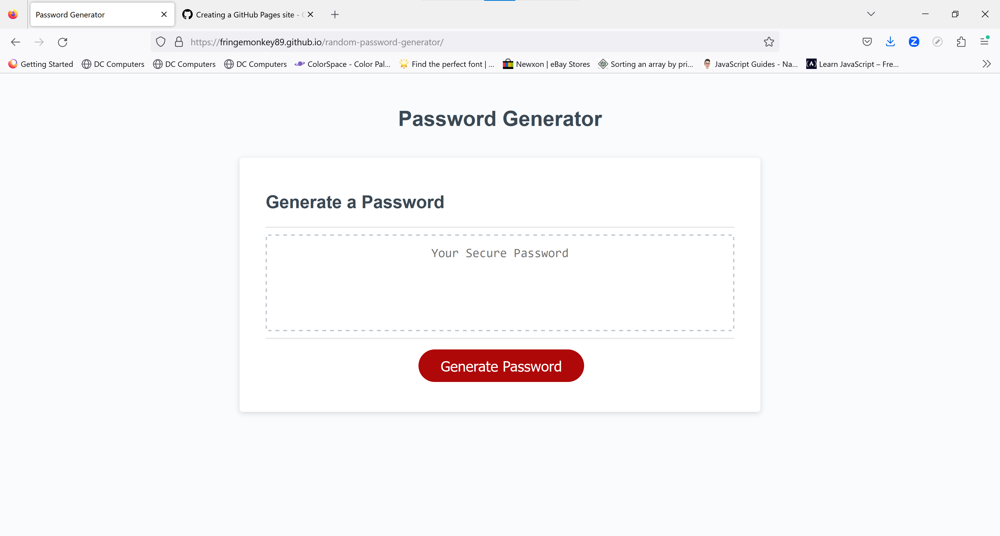

# Random-Password-Generator

## Summary
 My name is Marko Majetic , I am attending the UofT Bootcamp and I have created a random password generator using Javascript, HTML and CSS. This password generator uses prompts that allows a user to determine the preferred password length and which of the following character types to use (lowercase letters, uppercase letters, numbers, and/or special characters). I have created a function with javascript that would generate a password based on what criteria have been chosen through prompts.

## Usage

 - To run the application, click on the link near the bottom of the README.md file
 - You will be directed to the web-page where the password generator is located and
   you will click on the generate password button to start the process
 - You will answer a series of questions regarding what password criteria will be
   chosen (you must select at least one criteria, or else an error will appear and
   the prompts will start all over)
 - The password criteria are the following;
     The desired password length (on the condition that it is between 8 and 128 characters long)
     Whether you want the password to contain uppercase letters
     Whether you want the password to contain lowercase letters
     Whether you want the password to contain numbers
     Whether you want the password to contain special characters
       
    
## Screenshot

## Links
